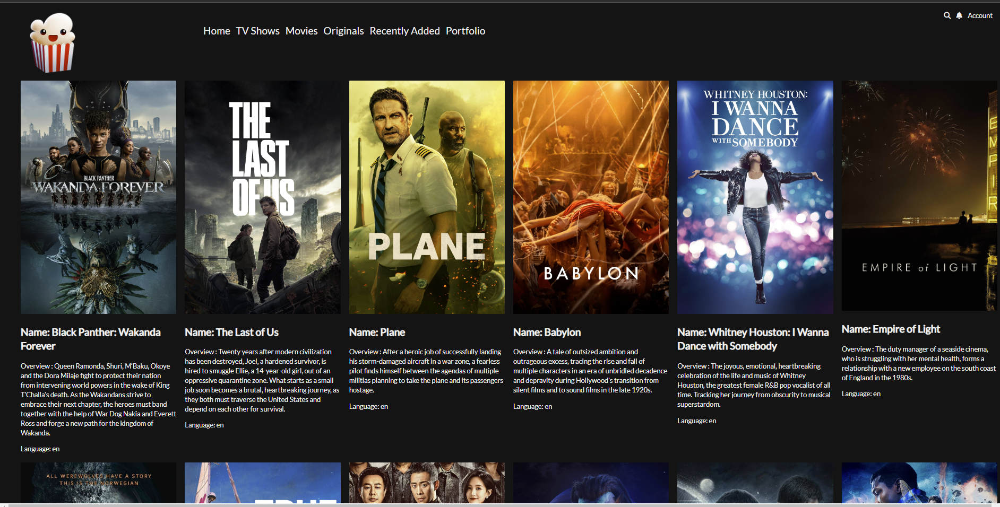

## Coppola Movie App

- Create a Movie App with HTML,CSS and Javascript. Use the Fetch API to fetch the data

1. Generate my own API KEY
2. Use Fetch API to get the data
3. Features:
 - `Get list of movies by trending`
 - `Search by movie name`
 - `Filter menu by movies or series based on genre`

 ## UI development
  

## Logo
  

## Clone this App 
`git clone: https://github.com/chicacode/coppola-movie-app.git`
 ## Tech stack used:
 - HTML5
 - CSS3
 - Javscript
 - Fetch API
 - FontAwesome

 ## Develop by:
 # Geri